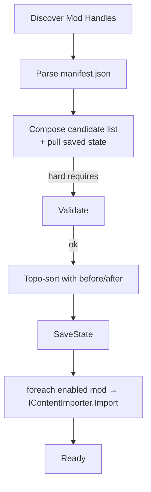
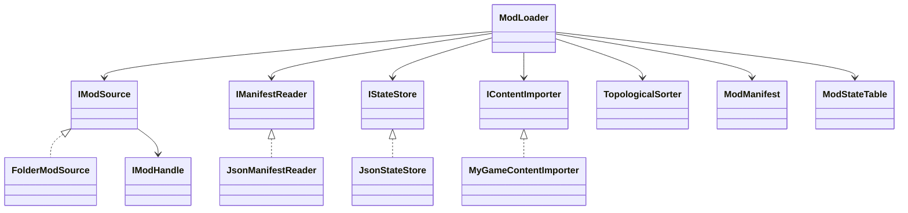

# **JG.Modding — Technical Design & Extension Guide**

This document is intentionally self-contained: once you have the code and this text, you need no other reference to **understand, maintain, or extend** the mod-loading subsystem.

---

## 1. High-level goals

| Goal                             | How the design meets it                                                                                                                                                                      |
| -------------------------------- | -------------------------------------------------------------------------------------------------------------------------------------------------------------------------------------------- |
| **Game-agnostic**                | All game-specific code is behind `IContentImporter`. Everything else manipulates generic JSON and streams.                                                                                   |
| **User-controlled load order**   | Order & on/off flags live in one persisted “state table”; a UI manipulates only that file.                                                                                                   |
| **Dependency safety**            | Manifests declare `requires`, `loadBefore`, `loadAfter`; a topological sorter enforces them and surfaces cycles.                                                                             |
| **Hot-reload (optional)**        | Setting `ModLoaderConfig.fullReloadOnChange = true` triggers a full re-import whenever the list changes.                                                                                     |
| **Replace-not-merge** simplicity | The concrete `Catalog<T>` the game already uses is populated **once per (re)load**; later mods simply “last-write-wins”. You can upgrade to merge patches later without touching the loader. |

---

## 2. Folder & file conventions

```
<yourGameRoot>
│
├─ Mods/                       ← source root (configurable)
│   ├─ MyMod/
│   │   ├─ manifest.json       ← REQUIRED
│   │   ├─ Tiles/*.json        ← whatever your game consumes
│   │   └─ Events/*.json
│   └─ TotalConversion/
│
└─ <persistentDataPath>/
    └─ modstate.json           ← auto-generated load order file
```

### 2.1 `manifest.json`

```jsonc
{
  "id":         "my_mod",              // unique, immutable
  "name":       "My Mod",
  "version":    "1.0.0",
  "author":     "Alice",
  "description":"Adds dragons.",
  "requires":   ["core_lib"],          // hard deps
  "loadBefore": ["balance_hotfix"],    // soft
  "loadAfter":  ["base_game"]          // soft
}
```

No ordering logic lives in folder names; users rearrange mods freely via the state table/UI.

### 2.2 `modstate.json`

```json
{
  "mods": [
    { "id":"base_game",        "enabled":true,  "order":0 },
    { "id":"my_mod",           "enabled":true,  "order":1 },
    { "id":"balance_hotfix",   "enabled":false, "order":2 }
  ]
}
```

* Written automatically after every discovery or UI change.
* Drives both **order** and **enabled/disabled** status on the next reload.

---

## 3. Key runtime abstractions

| Interface           | Responsibility                                                             | Typical implementation                     |
| ------------------- | -------------------------------------------------------------------------- | ------------------------------------------ |
| `IModSource`        | Discover *containers* that look like mods.                                 | `FolderModSource` (walks a directory tree) |
| `IModHandle`        | Provide read-only access to a mod’s files.                                 | `FolderHandle` (streams from disk)         |
| `IManifestReader`   | Parse a manifest into `ModManifest`.                                       | `JsonManifestReader`                       |
| `IStateStore`       | Load / save `modstate.json`.                                               | `JsonStateStore`                           |
| `IContentImporter`  | **Game-specific**: read a handle’s files and populate your catalogs.       | `MyGameContentImporter`                    |
| `TopologicalSorter` | Pure utility: turn “A before B” edges into a total order or detect cycles. | Provided in `TopologicalSorter.cs`         |

---

## 4. `ModLoader` lifecycle



1. **Discovery** – `IModSource` yields handles (default: each folder with `manifest.json`).
2. **Manifest parsing** – failure raises `OnLoadError` and skips that mod.
3. **State merge** – previously saved order/enabled flags are merged; new mods default to *enabled & last*.
4. **Dependency validation** – every `requires` must be present **and enabled**; otherwise `ErrorKind.MissingDependency`.
5. **Topological sort** – `loadBefore`/`loadAfter` edges are resolved; cycles raise `ErrorKind.CircularDependency`.
6. **Persist state** – `modstate.json` rewritten (so newly found mods appear in UI next launch).
7. **Content import** – in order, for *enabled* mods only, the importer streams JSON into your catalogs.
8. **Ready** – game continues; if `fullReloadOnChange` is true, any subsequent `Move`/`Enable` call repeats the whole flow.

---

## 5. Error model (`OnLoadError`)

```csharp
loader.OnLoadError += err =>
{
    switch (err.Kind)
    {
        case ErrorKind.MissingDependency:
        case ErrorKind.CircularDependency:
            ShowModal("Mod order error", err.Message);
            break;
        case ErrorKind.ManifestError:
        case ErrorKind.IoError:
            Log.Warn(err.Message);     // keep loading the rest
            break;
    }
};
```

* **Manifest / IO errors** – logged, mod skipped; others continue.
* **Missing or circular deps** – stop the load; UI should direct user to fix order/enable flags.

---

## 6. Extending / replacing parts

| You want…                            | Swap / extend                                                                                       | Notes                                                                |
| ------------------------------------ | --------------------------------------------------------------------------------------------------- | -------------------------------------------------------------------- |
| Load mods from Steam UGC zips        | `IModSource` + `IModHandle`                                                                         | Return `ZipHandle` that reads from an in-memory zip instead of disk. |
| Use YAML not JSON                    | `IManifestReader`, `IStateStore`                                                                    | Loader doesn’t care how objects are deserialized.                    |
| Merge-patch instead of replace       | change `Catalog.AddOrMerge` impl OR create `IPatchImporter`.                                        |                                                                      |
| Hot-swap content without full reload | implement incremental diff inside your own `IContentImporter` and set `fullReloadOnChange = false`. |                                                                      |

---

## 7. Integrating with an existing game

```csharp
void BootstrapMods()
{
    var cfg       = new ModLoaderConfig { modsRoot="Mods" };
    var source    = new FolderModSource(Path.Combine(AppContext.BaseDirectory, cfg.modsRoot));
    var manifest  = new JsonManifestReader();
    var state     = new JsonStateStore(Application.persistentDataPath, cfg.stateFile);
    var importer  = new MyGameContentImporter(/* references to your catalogs */);

    _modLoader = new ModLoader(cfg, source, manifest, state, importer);
    _modLoader.OnLoadError += err => Debug.LogError(err.Message);
}

/* UI bindings */
public void OnToggleMod(string id,bool on) => _modLoader.Enable(id,on);
public void OnMoveMod(string id,int newPos) => _modLoader.Move(id,newPos);
```

**`MyGameContentImporter` skeleton**

```csharp
public sealed class MyGameContentImporter : IContentImporter
{
    public void Import(IModHandle h)
    {
        // 1. Tiles
        foreach (var fp in Directory.GetFiles(Path.Combine(h.Path,"Tiles"),"*.json"))
            TileCatalog.Instance.AddOrReplace(
                JsonConvert.DeserializeObject<TileDef>(File.ReadAllText(fp)));

        // 2. Events … repeat for other asset types.
    }
}
```

Because the importer runs **once per reload**, a simple *clear-then-add* strategy is usually enough:

```csharp
TileCatalog.Instance.Clear();
```

(call once before the loop for the first mod).

---

## 8. Typical customisations

| Need                                                           | Quick change                                                                                                   |
| -------------------------------------------------------------- | -------------------------------------------------------------------------------------------------------------- |
| **Disabling the core game** when a total-conversion is enabled | In your UI, call `Move("total_conversion",0)` and `Enable("base_game",false)`.                                 |
| **Mod-specific settings UI**                                   | Add a “Configure” button that opens `manifest.customSettingsPath`; loader is unaffected.                       |
| **Version checks**                                             | Compare `ModManifest.version` against your own `GameVersion`; raise `ErrorKind.ManifestError` if incompatible. |

---

## 9. Unit-testing tips

1. Provide a fake `IModSource` that returns in-memory handles.
2. Feed crafted manifests to test:

   * missing deps
   * cycles
   * loadBefore/after precedence
3. Mock `IContentImporter` and assert the call order.

Because all side effects are behind interfaces, the core sort/resolve logic is fully deterministic and easy to test.

---

## 10. Performance footprint

* **Discovery + parsing:** O(N) over manifest count.
* **Topo sort:** O(N + E) using Kahn’s algorithm (tiny).
* **Content import:** dominated by JSON deserialization (your game already pays that cost).
* **Memory:** Loader itself stores only manifests, handles, and a few lists; negligible vs. game assets.

---

## 11. Roadmap suggestions

| Future feature                    | Minimal impact area                                                   |
| --------------------------------- | --------------------------------------------------------------------- |
| Workshop publishing / auto-update | new `IModSource` that watches a URL or SteamUGC.                      |
| Live enable/disable (no reload)   | add `Unload(IModHandle)` to `IContentImporter`.                       |
| Object-level merge patches        | extend `Catalog.AddOrMerge` to inspect a `"merge":true` flag in JSON. |

---

## 12. Appendix – Reference class diagram



---

### **That’s all you need.**

With this document and the codebase you uploaded, a new engineer can walk in, read for 15 minutes, and safely add new features or bug-fixes to the mod subsystem.
